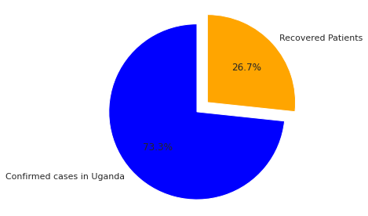
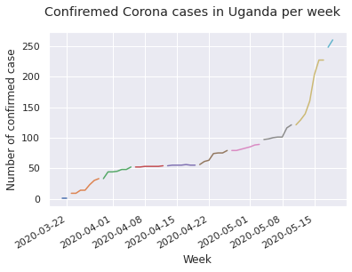
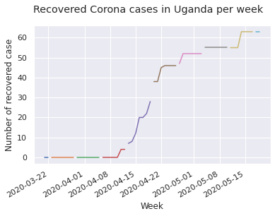

>
## Uganda Coronavirus Confiremed Cases Vs Recoveries    

### By Ronald Mulyowa 

> My name is Ronald Mulyowa,  currently pursuing a  Data Analyst Nanodegree Program at Udacity.com.
 ### Inspiration
> To present visual insights to coronavirus daily data for my country Uganda.
> Practicing to learn more.
### Great thanks to  Johns Hopkins University for making this dataset available


```python

```


```python
import pandas as pd
import numpy as np
import matplotlib.pyplot as plt 
import seaborn as sns
%matplotlib inline
sns.set()
```


```python
    ### Importing the corona virus dataset for analysis
    corona = pd.read_csv('covid_19_data.csv')
    corona.head()
 
```


<div>
<style scoped>
    .dataframe tbody tr th:only-of-type {
        vertical-align: middle;
    }

    .dataframe tbody tr th {
        vertical-align: top;
    }

    .dataframe thead th {
        text-align: right;
    }
</style>
<table border="1" class="dataframe">
  <thead>
    <tr style="text-align: right;">
      <th></th>
      <th>SNo</th>
      <th>ObservationDate</th>
      <th>Province/State</th>
      <th>Country/Region</th>
      <th>Last Update</th>
      <th>Confirmed</th>
      <th>Deaths</th>
      <th>Recovered</th>
    </tr>
  </thead>
  <tbody>
    <tr>
      <th>0</th>
      <td>1</td>
      <td>01/22/2020</td>
      <td>Anhui</td>
      <td>Mainland China</td>
      <td>1/22/2020 17:00</td>
      <td>1.0</td>
      <td>0.0</td>
      <td>0.0</td>
    </tr>
    <tr>
      <th>1</th>
      <td>2</td>
      <td>01/22/2020</td>
      <td>Beijing</td>
      <td>Mainland China</td>
      <td>1/22/2020 17:00</td>
      <td>14.0</td>
      <td>0.0</td>
      <td>0.0</td>
    </tr>
    <tr>
      <th>2</th>
      <td>3</td>
      <td>01/22/2020</td>
      <td>Chongqing</td>
      <td>Mainland China</td>
      <td>1/22/2020 17:00</td>
      <td>6.0</td>
      <td>0.0</td>
      <td>0.0</td>
    </tr>
    <tr>
      <th>3</th>
      <td>4</td>
      <td>01/22/2020</td>
      <td>Fujian</td>
      <td>Mainland China</td>
      <td>1/22/2020 17:00</td>
      <td>1.0</td>
      <td>0.0</td>
      <td>0.0</td>
    </tr>
    <tr>
      <th>4</th>
      <td>5</td>
      <td>01/22/2020</td>
      <td>Gansu</td>
      <td>Mainland China</td>
      <td>1/22/2020 17:00</td>
      <td>0.0</td>
      <td>0.0</td>
      <td>0.0</td>
    </tr>
  </tbody>
</table>
</div>


```python
## selecting my country uganda
# fist let me rename the heading colums
corona.rename(columns={'ObservationDate':'observation_date', 'Province/State':'state', 
                       'Country/Region':'country','Last Update':'last_update'}, inplace = True)
corona.head()

```


<div>
<style scoped>
    .dataframe tbody tr th:only-of-type {
        vertical-align: middle;
    }

    .dataframe tbody tr th {
        vertical-align: top;
    }

    .dataframe thead th {
        text-align: right;
    }
</style>
<table border="1" class="dataframe">
  <thead>
    <tr style="text-align: right;">
      <th></th>
      <th>SNo</th>
      <th>observation_date</th>
      <th>state</th>
      <th>country</th>
      <th>last_update</th>
      <th>Confirmed</th>
      <th>Deaths</th>
      <th>Recovered</th>
    </tr>
  </thead>
  <tbody>
    <tr>
      <th>0</th>
      <td>1</td>
      <td>01/22/2020</td>
      <td>Anhui</td>
      <td>Mainland China</td>
      <td>1/22/2020 17:00</td>
      <td>1.0</td>
      <td>0.0</td>
      <td>0.0</td>
    </tr>
    <tr>
      <th>1</th>
      <td>2</td>
      <td>01/22/2020</td>
      <td>Beijing</td>
      <td>Mainland China</td>
      <td>1/22/2020 17:00</td>
      <td>14.0</td>
      <td>0.0</td>
      <td>0.0</td>
    </tr>
    <tr>
      <th>2</th>
      <td>3</td>
      <td>01/22/2020</td>
      <td>Chongqing</td>
      <td>Mainland China</td>
      <td>1/22/2020 17:00</td>
      <td>6.0</td>
      <td>0.0</td>
      <td>0.0</td>
    </tr>
    <tr>
      <th>3</th>
      <td>4</td>
      <td>01/22/2020</td>
      <td>Fujian</td>
      <td>Mainland China</td>
      <td>1/22/2020 17:00</td>
      <td>1.0</td>
      <td>0.0</td>
      <td>0.0</td>
    </tr>
    <tr>
      <th>4</th>
      <td>5</td>
      <td>01/22/2020</td>
      <td>Gansu</td>
      <td>Mainland China</td>
      <td>1/22/2020 17:00</td>
      <td>0.0</td>
      <td>0.0</td>
      <td>0.0</td>
    </tr>
  </tbody>
</table>
</div>


```python
del corona['SNo']
```


```python
corona.info()
```

    <class 'pandas.core.frame.DataFrame'>
    RangeIndex: 26713 entries, 0 to 26712
    Data columns (total 7 columns):
     #   Column            Non-Null Count  Dtype  
    ---  ------            --------------  -----  
     0   observation_date  26713 non-null  object 
     1   state             12882 non-null  object 
     2   country           26713 non-null  object 
     3   last_update       26713 non-null  object 
     4   Confirmed         26713 non-null  float64
     5   Deaths            26713 non-null  float64
     6   Recovered         26713 non-null  float64
    dtypes: float64(3), object(4)
    memory usage: 1.4+ MB


```python
# converting the observation column to date
corona['observation_date'] = pd.to_datetime(corona['observation_date'])
## seting 

```


```python
#  setting the observation date as index
corona = corona.set_index('observation_date')
```


```python
uganda = corona.query("country =='Uganda'")
uganda.tail()
```


<div>
<style scoped>
    .dataframe tbody tr th:only-of-type {
        vertical-align: middle;
    }

    .dataframe tbody tr th {
        vertical-align: top;
    }

    .dataframe thead th {
        text-align: right;
    }
</style>
<table border="1" class="dataframe">
  <thead>
    <tr style="text-align: right;">
      <th></th>
      <th>state</th>
      <th>country</th>
      <th>last_update</th>
      <th>Confirmed</th>
      <th>Deaths</th>
      <th>Recovered</th>
    </tr>
    <tr>
      <th>observation_date</th>
      <th></th>
      <th></th>
      <th></th>
      <th></th>
      <th></th>
      <th></th>
    </tr>
  </thead>
  <tbody>
    <tr>
      <th>2020-05-15</th>
      <td>NaN</td>
      <td>Uganda</td>
      <td>2020-05-16 02:32:19</td>
      <td>203.0</td>
      <td>0.0</td>
      <td>63.0</td>
    </tr>
    <tr>
      <th>2020-05-16</th>
      <td>NaN</td>
      <td>Uganda</td>
      <td>2020-05-17 02:32:32</td>
      <td>227.0</td>
      <td>0.0</td>
      <td>63.0</td>
    </tr>
    <tr>
      <th>2020-05-17</th>
      <td>NaN</td>
      <td>Uganda</td>
      <td>2020-05-18 02:32:21</td>
      <td>227.0</td>
      <td>0.0</td>
      <td>63.0</td>
    </tr>
    <tr>
      <th>2020-05-18</th>
      <td>NaN</td>
      <td>Uganda</td>
      <td>2020-05-19 02:32:18</td>
      <td>248.0</td>
      <td>0.0</td>
      <td>63.0</td>
    </tr>
    <tr>
      <th>2020-05-19</th>
      <td>NaN</td>
      <td>Uganda</td>
      <td>2020-05-20 02:32:19</td>
      <td>260.0</td>
      <td>0.0</td>
      <td>63.0</td>
    </tr>
  </tbody>
</table>
</div>


```python
del uganda['state']
del uganda['last_update']
```


```python
uganda.shape
```


    (60, 4)


```python
uganda.head()
```


<div>
<style scoped>
    .dataframe tbody tr th:only-of-type {
        vertical-align: middle;
    }

    .dataframe tbody tr th {
        vertical-align: top;
    }

    .dataframe thead th {
        text-align: right;
    }
</style>
<table border="1" class="dataframe">
  <thead>
    <tr style="text-align: right;">
      <th></th>
      <th>country</th>
      <th>Confirmed</th>
      <th>Deaths</th>
      <th>Recovered</th>
    </tr>
    <tr>
      <th>observation_date</th>
      <th></th>
      <th></th>
      <th></th>
      <th></th>
    </tr>
  </thead>
  <tbody>
    <tr>
      <th>2020-03-21</th>
      <td>Uganda</td>
      <td>1.0</td>
      <td>0.0</td>
      <td>0.0</td>
    </tr>
    <tr>
      <th>2020-03-22</th>
      <td>Uganda</td>
      <td>1.0</td>
      <td>0.0</td>
      <td>0.0</td>
    </tr>
    <tr>
      <th>2020-03-23</th>
      <td>Uganda</td>
      <td>9.0</td>
      <td>0.0</td>
      <td>0.0</td>
    </tr>
    <tr>
      <th>2020-03-24</th>
      <td>Uganda</td>
      <td>9.0</td>
      <td>0.0</td>
      <td>0.0</td>
    </tr>
    <tr>
      <th>2020-03-25</th>
      <td>Uganda</td>
      <td>14.0</td>
      <td>0.0</td>
      <td>0.0</td>
    </tr>
  </tbody>
</table>
</div>


```python
## viewing percentage of confimed cases vs recoveries
confirmed = uganda.Confirmed.sum()
recovered = uganda.Recovered.sum()

## propotions for confiremed  and recoveries
proportions  = [confirmed, recovered]
# ploting them on a pie chart
plt.pie(proportions,
       # adding labels
       labels = ['Confirmed cases in Uganda', 'Recovered Patients'],
       shadow = False,
       colors = ['blue', 'orange'],
        # one slide will explode out
        explode = (0.16,0),
        startangle = 90,
        # listing the percentage
        autopct = '%1.1f%%'      
     
)
# view the plot drop
plt.axis('equal')

plt.title = (" Confiremed cases in uganda vs Recoveries")
plt.tight_layout()
plt.show()


```





```python
# grouping the data per week to know how we have been fairing per week
uganda_week = uganda.groupby('country').resample('W')
uganda_week.Confirmed.plot()
plt.suptitle('Confiremed Corona cases in Uganda per week')
plt.xlabel('Week')
plt.ylabel('Number of confirmed case')

plt.show()


```





```python
del uganda_week['Deaths']
```


```python
## Ploting recoveries
uganda_week = uganda.groupby('country').resample('W')
uganda_week.Recovered.plot()
plt.suptitle('Recovered Corona cases in Uganda per week')
plt.xlabel('Week')
plt.ylabel('Number of recovered case')

plt.show()

```





```python

```
# corona
